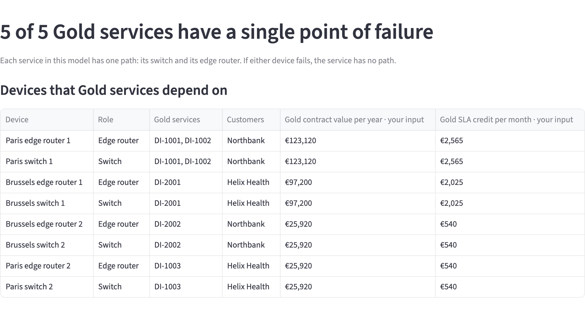
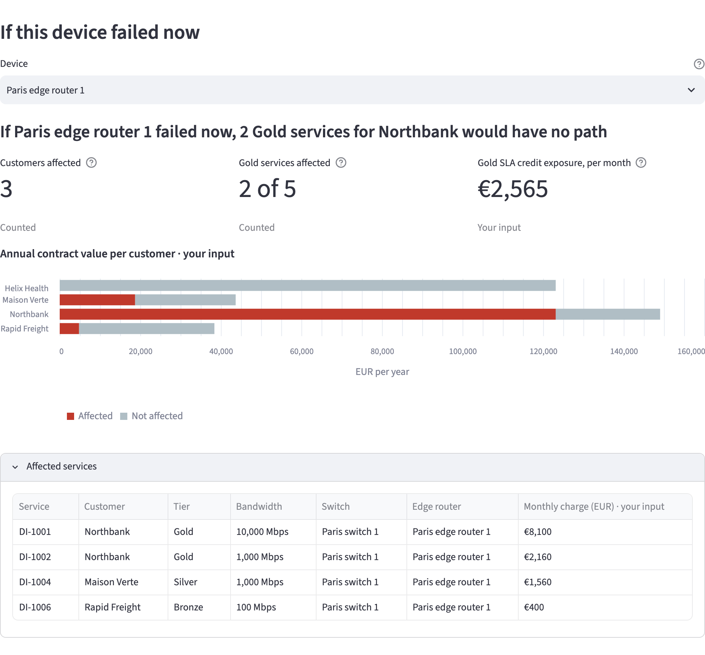
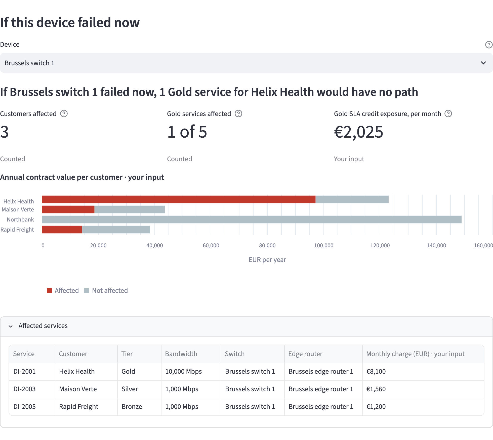

# Find the Gold services that depend on a single device

Use the Single points of failure view to find the switches and edge routers whose failure would leave Gold services with no path, and to decide which Gold services need a second path. The view only reads the current network.

## Before you begin

Install the demo and run the optional seed step, as described in the [installation guide](../getting-started/installation.mdx). For what counts as a single point of failure, read the [business impact overview](overview.mdx#single-points-of-failure).

## View the Gold services with a single point of failure

1. Open the portal at `http://localhost:8501` and select **Business Impact** in the sidebar.
2. Under **View**, select **Single points of failure**.

The headline shows how many active Gold services have a single point of failure:

> 5 of 5 Gold services have a single point of failure

Each service in the demo has one path: its switch and its edge router. Each of these devices is a single point of failure for the services behind it.

The table **Devices that Gold services depend on** lists each switch and edge router with Gold services behind it, ranked by the Gold contract value per year of those services. For each device, it shows the role, the Gold services, the customers, the Gold contract value per year and the Gold SLA credit per month.

Paris edge router 1 and Paris switch 1 are at the top. DI-1001 and DI-1002 of Northbank depend on them: €123,120 of Gold contract value a year, and €2,565 of Gold SLA credit a month.

## View what would have no path if a device failed now

Under **If this device failed now**, select a device in **Device**. The view sets that device to not active in a copy of the current network, and shows the same figures as the Blast radius view: a headline, the three tiles, the annual contract value per customer and the affected services.

For Paris edge router 1, the headline shows "If Paris edge router 1 failed now, 2 Gold services for Northbank would have no path", and the tiles show 3, 2 of 5 and €2,565. Open **Affected services** to view DI-1001 and DI-1002, and the Silver and Bronze services DI-1004 and DI-1006 behind the same router.

Select Brussels switch 1. The headline shows "If Brussels switch 1 failed now, 1 Gold service for Helix Health would have no path", and the tiles show 3, 1 of 5 and €2,025.

## Decide which Gold services need a second path

The devices at the top of the table have the most Gold contract value behind them. A Gold service still has a path after one device fails only when it has a second path, through another switch and edge router. Start with the Gold services behind the devices at the top of the table.

For a planned change on one of these devices, move its Gold services to the other device at the site first, as in [Plan maintenance that keeps Gold services in service](plan-maintenance.mdx).
