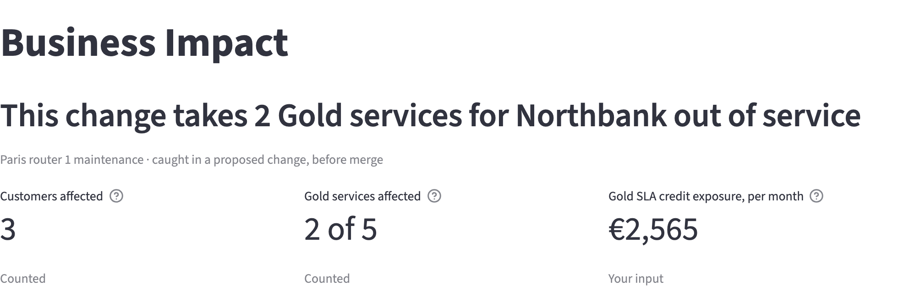
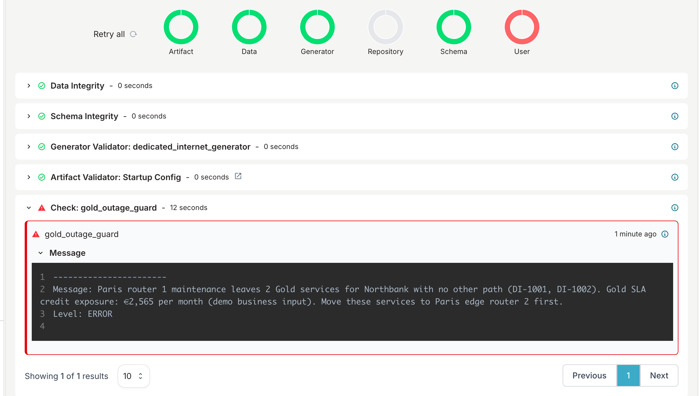

# Business impact

In this demo, each service is linked to its customer, its service tier and its monthly charge, in the same Infrahub graph as the switch, edge router and IP resources the service runs on. With that link in place, you can plan a change by its effect on customers. Before a proposed change merges, the Business Impact page shows which services have no other path while the change is in place, and Infrahub refuses to merge a plan that leaves a Gold service without one.

## Why business context belongs in the source of truth

Change review usually happens at the level of devices and interfaces. A maintenance window on an edge router looks the same whether a lab circuit or the main internet connection of your largest customer runs through the router. The people who plan and approve the change ask a different question: which customers depend on this device during the window, and which of them have a commitment that needs another path first?

When customers, tiers and contract value are stored in a separate CRM or spreadsheet, someone answers that question manually, if at all, and usually after the window is scheduled. When they are stored in the same graph as the infrastructure, the answer is on the proposed change itself, built from the same data the automation already uses. The answer is part of the review, and you can enforce a rule such as "no plan may leave a Gold service without a path" as a check instead of a reminder.

## The business data

The demo schema adds three pieces of business data to every Dedicated Internet service. All three are demo business inputs, chosen to be plausible, not taken from a real price list:

| Data | Values in the demo | Where it is stored |
|---|---|---|
| Service tier | Gold, Silver, Bronze, each with an SLA credit percentage (25, 10, 5) and a price multiplier | `ServiceTier` node |
| Customer | Northbank, Helix Health, Maison Verte, Rapid Freight | `OrganizationCustomer` node, beside manufacturers and providers |
| Monthly charge | Base price by bandwidth times the tier multiplier, in euros | `monthly_charge` on the service |

The customer, tier and monthly charge are branch-aware. You can change them in a proposed change without changing the current network.

## When a service counts as affected

A service is affected when at least one device behind its interfaces, its switch or its edge router, has any status other than active on the proposed change. Maintenance, provisioning and drained all count as out of service. Interface status is not considered.

Each service has one path in this demo, so a Gold service behind a device in maintenance is affected. A service with both of its devices out of service counts once.

## Counted figures and your input

Every figure on the Business Impact page has one of two labels:

- **Counted**: counted from the model, such as the number of customers affected.
- **Your input**: the model combined with a business input, such as a monthly charge or a tier's SLA credit percentage.

The page does not calculate outage cost, time saved, return on investment or churn. Money appears only as contract value or as SLA credit exposure.

## The SLA credit assumption

The Gold SLA credit exposure includes affected Gold services only. The demo data assumes that announced maintenance is excluded from Silver and Bronze SLAs. Many real carrier SLAs exclude maintenance at every tier; on those contracts, maintenance leads to no SLA credit at all. Treat the exposure as a figure that depends on your contract terms, not as a fixed property of the change.

## The Gold outage guard

The Gold outage guard is a check in the proposed change pipeline. It reads the same data as the Business Impact page and applies the same rule for "affected". For each proposed change, the result is:

| Situation | Result |
|---|---|
| An active Gold service has a device that is active on the current network and not active in the proposed change | Fails. The plan leaves the service with no other path |
| A Gold service's device was already out of service on the current network | Passes, and logs a message naming the service |
| Only Silver or Bronze services are affected, or none | Passes |

Infrahub does not merge a proposed change while a check has failed. The guard has no override: no tag, setting or role allows the change to merge. To merge, complete the plan first: move the Gold services to the other device at the site in the proposed change, as the plan in the tutorial's last step does.

## Single points of failure

A device is a single point of failure for a service when every path of the service passes through it. In the demo, each service has one path: its switch and its edge router. If either device fails, the service has no path, so each Gold service has two single points of failure.

The Single points of failure view on the Business Impact page shows this for the current network, without a proposed change. It counts the active Gold services with a single point of failure, ranks the devices they depend on by Gold contract value, and shows what would have no path if a selected device failed now. For the selected device, it uses the same rule and figures as the Blast radius view, on a copy of the current network with that device not active. The view only reads data from Infrahub.

## The audit record of an approved change

Infrahub keeps a record of each proposed change. For an approved plan, it shows what an auditor asks for:

- The plan: the proposed change's description, and its **Data** tab before the merge
- The guard result: the Gold outage guard's conclusion and message on the **Checks** tab. When the guard passes, its message records the Gold SLA credit exposure at approval time
- Who approved it and when: **Approved by** on the proposed change, and the approval and merge with their dates on the **Activity** page

Infrahub refuses an approval from the account that opened the proposed change. In the demo, `admin` opens the plans and Emma, the change manager account, approves them; see the [tutorial's last steps](plan-maintenance.mdx#step-8-view-the-audit-record-of-the-approved-change).

To load the demo data, run the optional seed step in the [installation guide](../getting-started/installation.mdx#step-6-seed-the-business-impact-demo-optional).

## In this section

- [Plan maintenance that keeps Gold services in service](plan-maintenance.mdx): Find the Gold services that depend on Paris edge router 1, move them first, and merge the plan once no Gold service depends on the router
- [Find the Gold services that depend on a single device](find-single-points-of-failure.mdx): View which Gold services have a single point of failure, and what would have no path if a switch or edge router failed now
