# Plan maintenance that keeps Gold services in service

You plan maintenance on Paris edge router 1 (`rb01-par01`). The goal is that no Gold customer loses service during the window. Before the window is scheduled, you check which services depend only on this router, and you move the Gold services to Paris edge router 2.

The demo data contains this plan as a proposed change named "Paris router 1 maintenance". It sets the router to maintenance on its own branch. Nothing has merged.

In the demo, each service has one path: one switch and one edge router. Paris edge router 2 is in the same site, but no service uses it as a second path. A service behind a device in maintenance therefore has no other path during the window.

## Why a maintenance plan needs a check on Gold services

Maintenance is usually reviewed device by device. The review shows the router, not the customers behind it, so the question "which customers lose service?" is answered manually, if at all, and often after the window is scheduled. Gold customers pay for redundancy so that maintenance causes no downtime. A plan that takes their only path out of service breaks that commitment and exposes you to SLA credits. In this tutorial, the proposed change shows the affected customers and the credit exposure before approval, and the Gold outage guard blocks the merge until the plan moves the Gold services. For the reasoning behind storing business context in the same graph as the network, see the [business impact overview](overview.mdx#why-business-context-belongs-in-the-source-of-truth).

## Before you begin

Install the demo and run the optional seed step, as described in the [installation guide](../getting-started/installation.mdx). The seed step creates twelve services in Paris and Brussels and four maintenance proposed changes:

- "Paris router 1 maintenance" sets `rb01-par01` to maintenance
- "Brussels switch 1 maintenance" sets `sw01-bru01` to maintenance
- "New York router 1 maintenance" sets `rb01-nyc01` to maintenance; no active service runs through it
- "Paris router 1 maintenance, Gold services moved first" moves DI-1001 and DI-1002 to Paris switch 2 and Paris edge router 2, then sets `rb01-par01` to maintenance

For when a service counts as affected and what each label on the page means, see the [business impact overview](overview.mdx).

## Step 1: check which services depend on the router

Open the portal at `http://localhost:8501` and select the **📊 Business impact** card on the home page, or **Business Impact** in the sidebar. Under **View**, **Blast radius** is selected.

The **Proposed change** picker opens on "Paris router 1 maintenance". The headline shows:

> 2 Gold services for Northbank have no other path during this change

The three tiles below it show:

| Tile | Value | Label |
|---|---|---|
| Customers affected | 3 | Counted |
| Gold services affected | 2 of 5 | Counted |
| Gold SLA credit exposure, per month | €2,565 | Your input |

The exposure is the monthly charge of each affected Gold service times the Gold tier's SLA credit of 25%. It is the SLA credit the plan would cost if it went ahead as it is. It includes Gold services only, under the demo's SLA assumption.

## Step 2: find the Gold services to move first

The chart **Annual contract value per customer · your input** shows one bar per customer, with the part that depends on the router marked. The Northbank bar shows €123,120 of €149,040 a year. The Maison Verte bar shows €18,720, Rapid Freight €4,800, and Helix Health nothing.

Open **Affected services** to see each service with its customer, tier, bandwidth, switch, edge router and monthly charge. DI-1001 and DI-1002 are the two Gold services of Northbank behind Paris edge router 1. These are the services to move before the maintenance. DI-1004 (Silver) and DI-1006 (Bronze) depend on the router too; the demo's Silver and Bronze SLAs exclude announced maintenance.

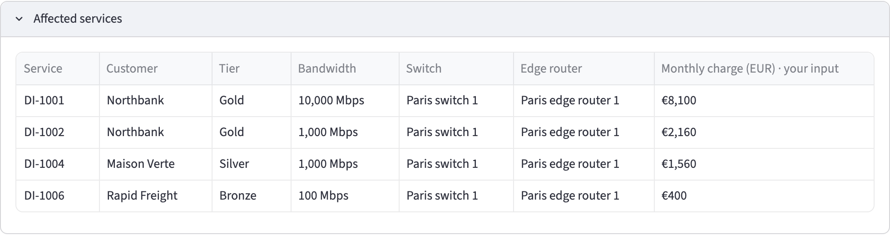

Open **Edge routers ranked by Gold contract value · your input**. Paris edge router 1 has the **In this change** marker, because its status in the proposed change differs from the current network. Paris edge router 2 is the router in the same site to move the Gold services to.

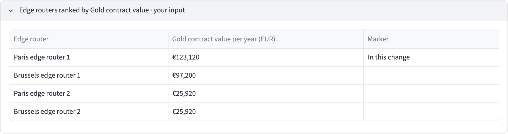

To view what would have no path if Paris edge router 1 failed without a plan, read [Find the Gold services that depend on a single device](find-single-points-of-failure.mdx).

## Step 3: compare with the current network and the other plans

Select "Current network" in the picker. The headline shows "No service is affected", the tiles show 0, 0 of 5 and €0, and no bar in the chart is marked. Compare this with the "Paris router 1 maintenance" view:

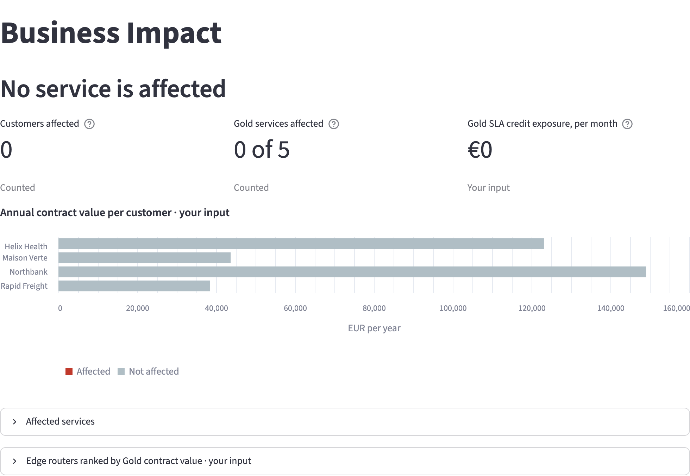

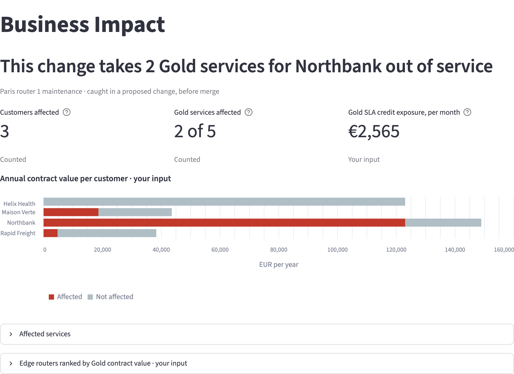

Select "Brussels switch 1 maintenance". The headline shows "1 Gold service for Helix Health has no other path during this change", and the tiles show 3, 1 of 5 and €2,025. A switch in maintenance affects the services behind it in the same way as an edge router, so this plan also has a Gold service to move first.

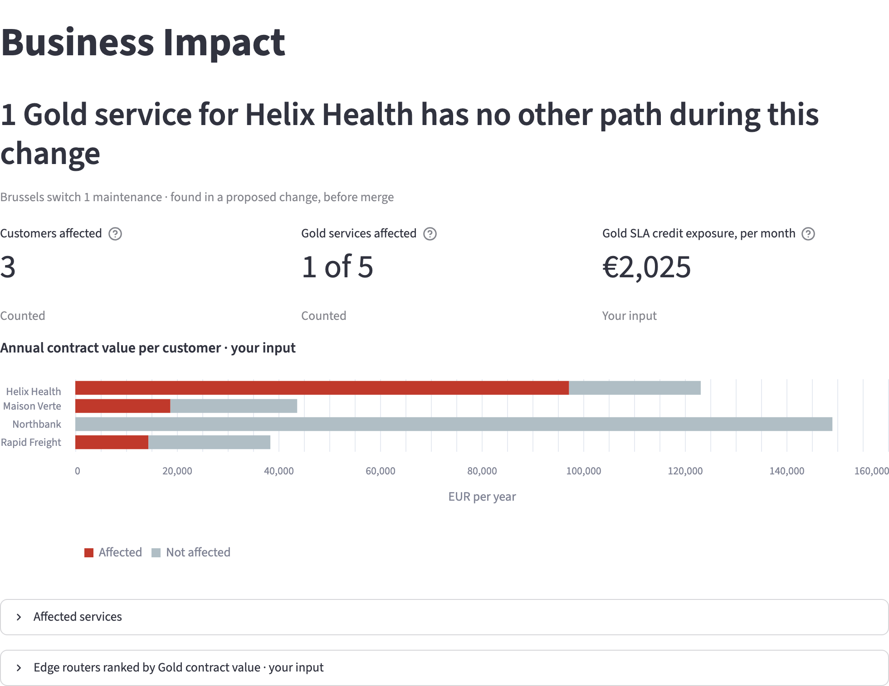

Select "New York router 1 maintenance". The headline shows "No service is affected", as on the current network. This plan has nothing to move.

## Step 4: read why the plan is not complete yet

Open Infrahub at `http://localhost:8000` and sign in as `admin` / `infrahub`. Go to **Proposed Changes** and open "Paris router 1 maintenance". On the **Checks** tab, the Gold outage guard, listed as `gold_outage_guard`, has failed with this message:

> Paris router 1 maintenance leaves 2 Gold services for Northbank with no other path (DI-1001, DI-1002). Gold SLA credit exposure: €2,565 per month (demo business input). Move these services to Paris edge router 2 first. Gold requires at least 1 separate path during a change, and this change leaves 0.

The check reads the same data as the Business Impact page. It counts the separate paths each active service keeps during the change and compares that number with the rule of the service's tier. The message names the services to move and where to move them. Its last sentence states the Gold tier's rule, the minimum number of separate paths during a change, and how many paths the plan leaves.

## Step 5: try to merge the incomplete plan

Select **Merge** on the proposed change. Infrahub refuses with "Unable to merge proposed change containing failing checks", and the router stays active on the current network.

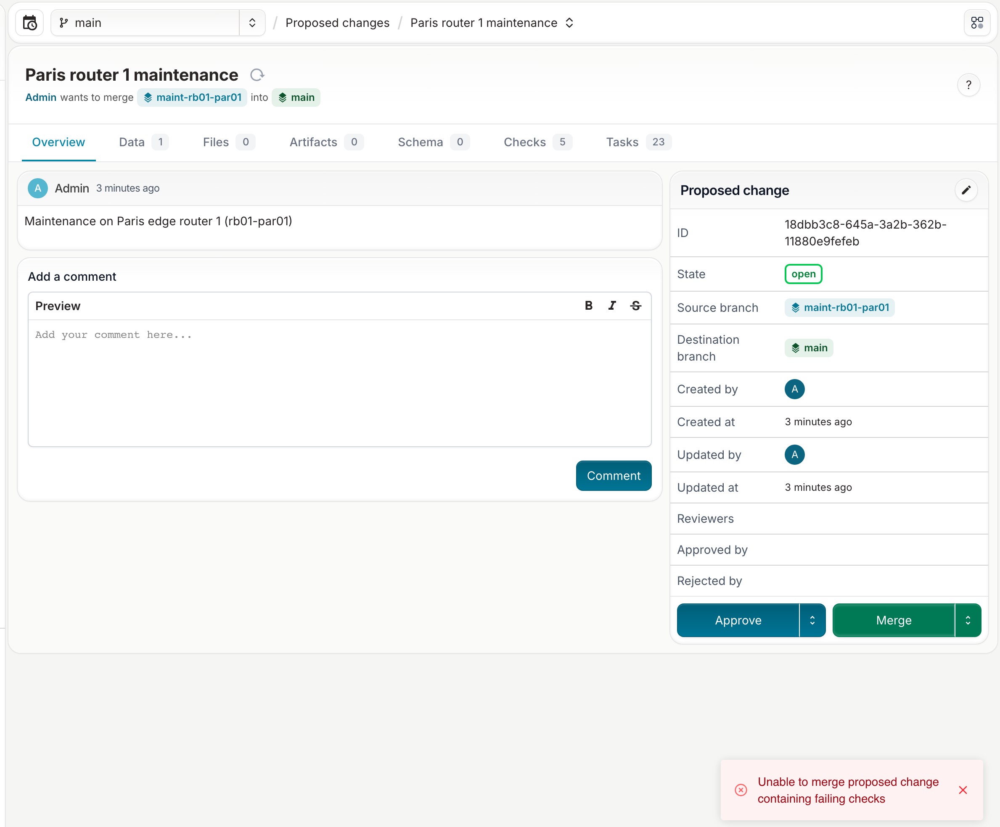

The Gold outage guard has no override. The plan can merge only after it moves the Gold services first, as in Step 8.

## Step 6: open a plan that has nothing to move

Open "New York router 1 maintenance". No active service runs through `rb01-nyc01`, so the Gold outage guard passes and does not block the merge.

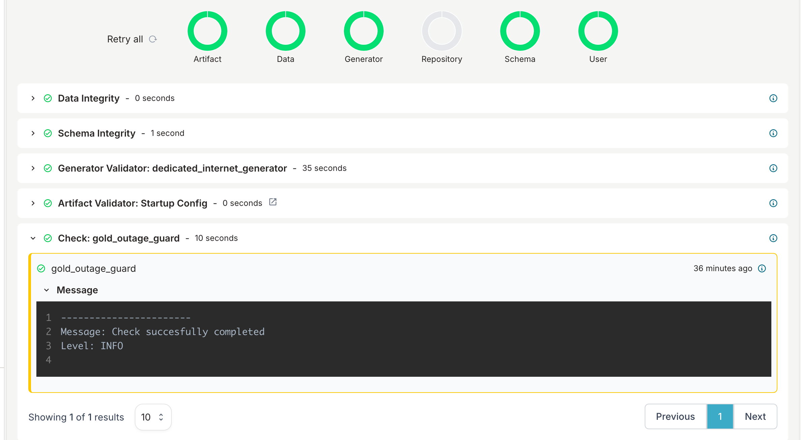

## Step 7: raise a tier rule and view the guard fail

Each service tier carries a rule: the minimum number of separate paths each of its active services keeps during a change. On the current network, Gold has 1, Silver 0 and Bronze 0. A change to a tier's rule is a change to a customer commitment, and you plan it in a proposed change in the same way as maintenance. In this step, you promise Silver customers two separate paths during a change, and the guard compares that promise with the network.

1. In Infrahub, create a branch named `raise-silver-rule`.
2. On that branch, open **Services**, then **Service Tiers**, and select Silver. Set **Minimum separate paths during a change** to 2 and save.
3. Open **Proposed Changes** and create a proposed change from `raise-silver-rule` to `main`, named "Promise two paths to Silver customers".

When the pipeline finishes, the Gold outage guard on the **Checks** tab has failed with this message:

> Promise two paths to Silver customers raises the Silver rule from 0 to 2 separate paths during a change, and 3 active Silver services have fewer (DI-1004, DI-1005, DI-2003: 1 each). Build the paths first, or keep the rule at 0.

Each service has one path in the demo, so no Silver service meets the new rule. Select **Merge**. Infrahub refuses with "Unable to merge proposed change containing failing checks", and Silver keeps a rule of 0 on the current network.

The Gold outage guard applies the rule of every tier, not only Gold. It kept the name "Gold outage guard" from when only Gold had a rule.

## Step 8: approve and merge the plan with the Gold services moved first

The proposed change "Paris router 1 maintenance, Gold services moved first" is the complete plan. On its branch, the seed step moved DI-1001 and DI-1002 to free customer ports on Paris switch 2 and ran the provisioning generator for each one. The generator put their gateways on Paris edge router 2 and removed the gateways from Paris edge router 1. The seed step then set Paris edge router 1 to maintenance.

In the portal, select "Paris router 1 maintenance, Gold services moved first". The headline shows "2 services have no other path during this change, and none of them is Gold". The tiles show 2, 0 of 5 and €0. DI-1004 and DI-1006 still depend on the router.

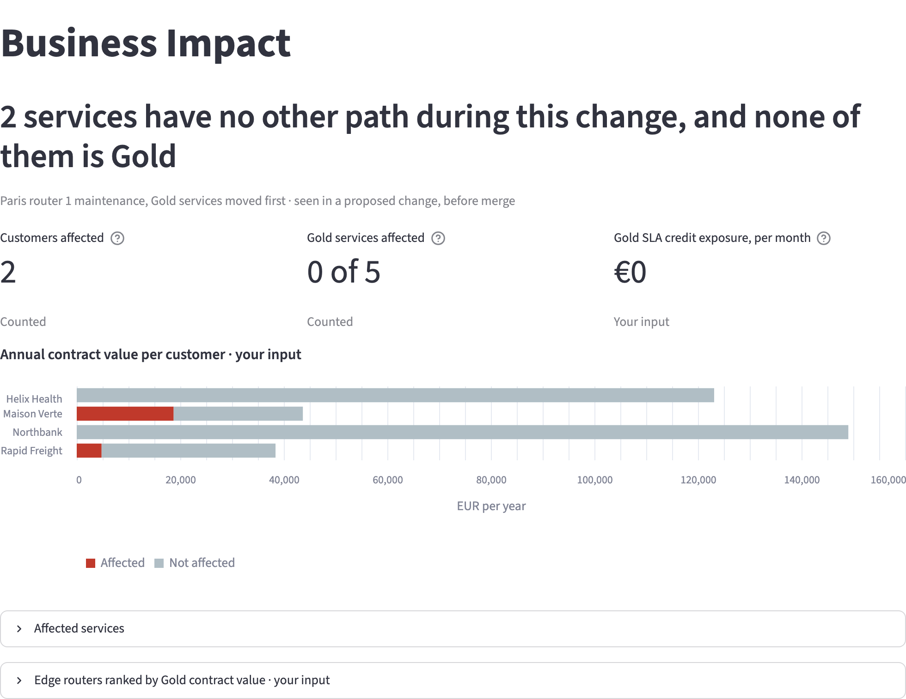

In Infrahub, open the proposed change. On the **Data** tab, the plan is listed as changes against the current network: the switch 2 ports and router 2 gateways that DI-1001 and DI-1002 now use, the freed switch 1 ports, the removed router 1 gateways, and the status of Paris edge router 1.

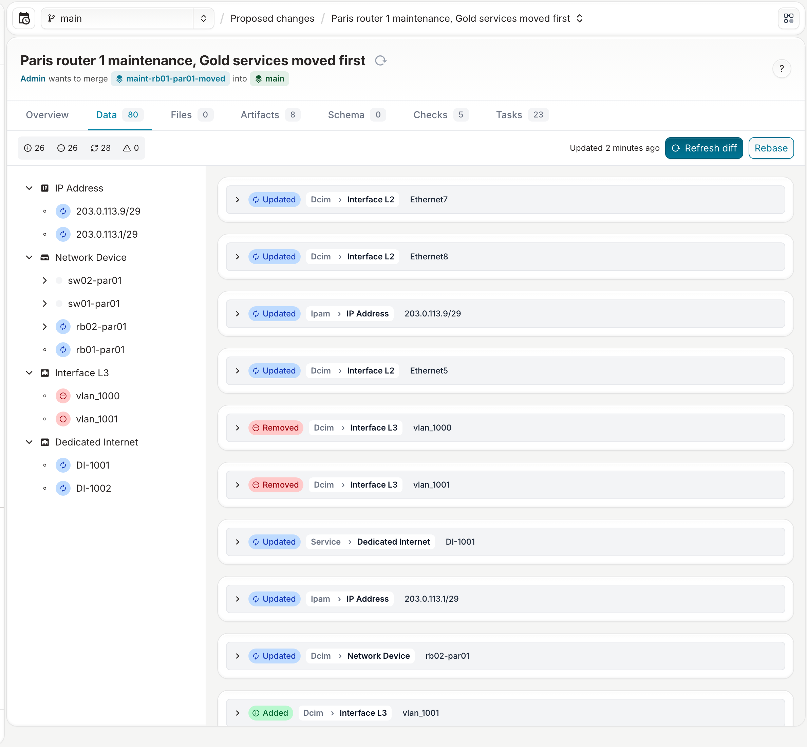

On the **Checks** tab, the Gold outage guard has passed. Its message records the Gold SLA credit exposure of the plan:

> Paris router 1 maintenance, Gold services moved first leaves no active Gold service without a path. Gold SLA credit exposure: €0 per month (demo business input).

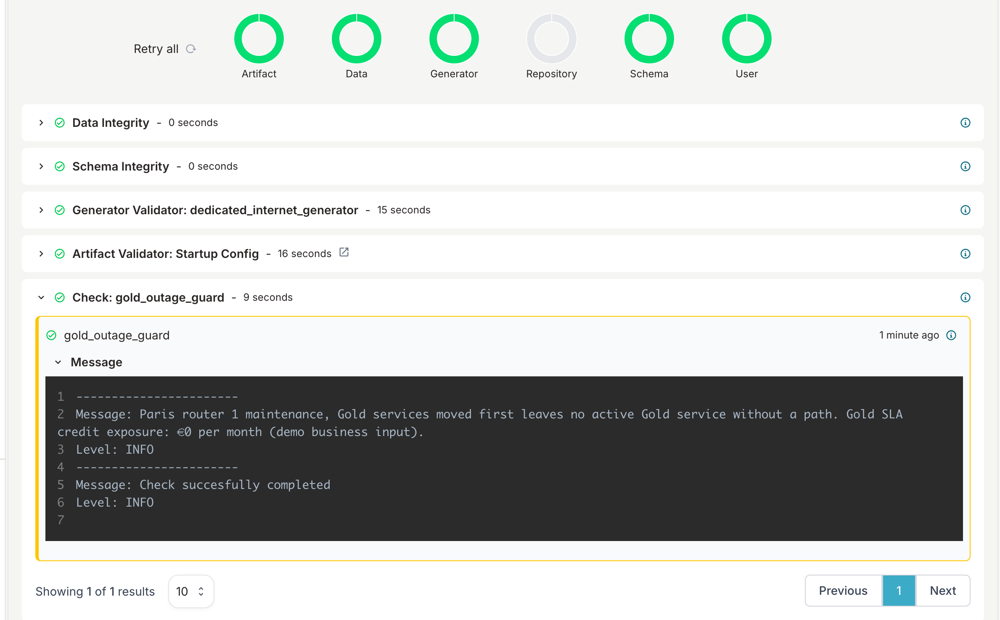

Infrahub does not let the account that opened a proposed change approve it. The seed step opened the plan as `admin`, so sign out and sign in as `emma` / `infrahub`, the change manager account from the [installation guide](../getting-started/installation.mdx). Select **Approve**, then **Merge**. Infrahub merges the plan: on the current network, DI-1001 and DI-1002 now run through Paris edge router 2, and Paris edge router 1 is in maintenance. Merging changes the demo's current network, so do this step after the others.

## Step 9: view the audit record of the approved change

After the merge, Infrahub keeps the record an auditor needs: the plan, the guard result, who approved it and when, and the exposure at approval time.

Open the merged proposed change. The **State** is merged, **Approved by** shows Emma, and the timeline lists "Emma approved the proposed change", "merged the branch" and "merged the proposed change". The description states the plan.

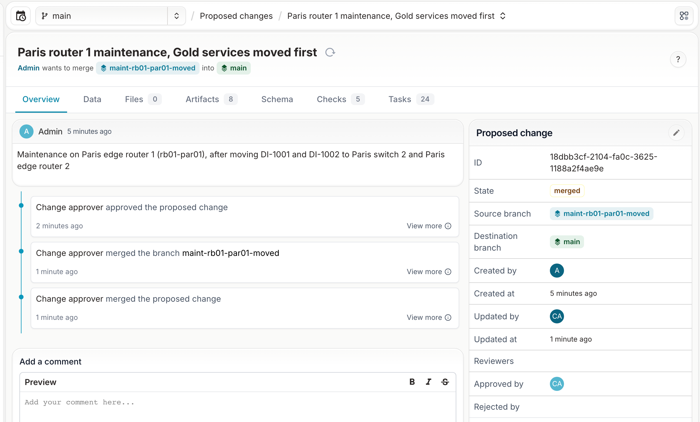

On the **Checks** tab, the Gold outage guard result is the one Emma saw when approving, with the exposure at approval time.

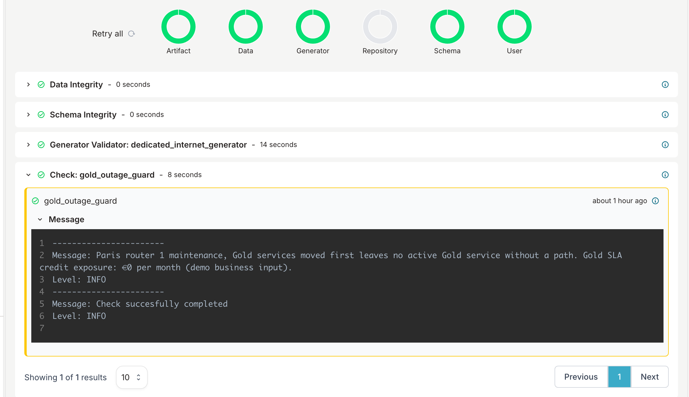

Select **Activity** in the menu. Select **Related Node**, choose the kind **Proposed Change**, and then select the plan. The list shows each event with its date, account and branch: the proposed change created by Admin, each validator that started and passed, and the update by Emma when the plan was approved and merged.

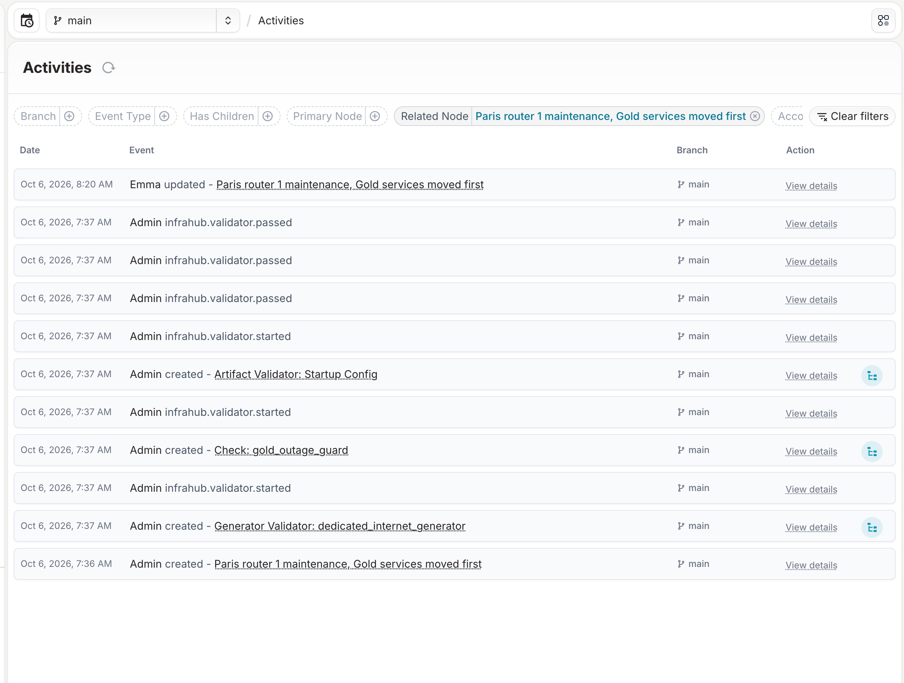

The demo runs on Infrahub Community. Infrahub records Emma's approval and refuses an approval from the account that opened the proposed change, but does not require an approval before merge. Infrahub Enterprise can require approvals before merge.

Each service also records who requested it and why: open **Services**, then **Dedicated Internet**, and select DI-1001, where **Requested by** reads "Northbank network operations" and **Reason for the request** reads "Primary internet access for the Paris trading floor".

## Optional: change a device status yourself

On the branch of a proposed change, set another device to maintenance in the Infrahub UI, for example `rb01-bru01`. The Business Impact page caches its reads for 10 seconds, so the change shows on the first page refresh after that.

## What you did

You planned maintenance on Paris edge router 1 so that no Gold customer depends on the router during the window. The Business Impact page showed which services had no other path and the SLA credit the plan would cost as it was. The Gold outage guard kept the incomplete plan from merging, and named the services to move. When you raised the Silver rule to 2 separate paths, the guard failed that proposed change too, because no Silver service has a second path. The plan that moved the Gold services first passed the guard, was approved by Emma and merged, and Infrahub kept the record of who approved it, when, and with which guard result.
